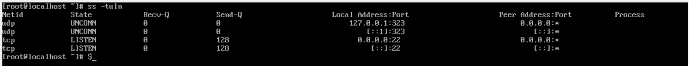

# TP Avancé : "Mission Ultime : Sauvegarde et Sécurisation"

## Étape 1 : Analyse et nettoyage du serveur

### 1. Lister les tâches cron pour détecter des backdoors :

*[root@localhost]# crontab -u attacker -l*

*/10 * * * */ tmp/.hidden_script

### 2. Identifier et supprimer les fichiers cachés :

Ici on va juste chercher tout les fichier grace à ``ls le_fichier -a`` 

suite à cela on supprimera tout les fichier avec un contenu malveilant ou inconnu

### 3. Analyser les connexions réseau actives :

ici on va taper la commande ``ss -tuln`` pour voir toutes les connexions entrentes



## Étape 2 : Configuration avancée de LVM

### 1. Créer un snapshot de sécurité pour ``/mnt/secure_data`` :

```[root@vbox secure_data]# lvcreate -L 500MB -s -n data_snap /dev/vg_secure/secure_data
 
Logical volume "data_snap" created.

 [root@vbox secure_data]# lvs

  LV          VG        Attr       LSize   Pool Origin      Data%  Meta%  Move Log Cpy%Sync Convert
 root        rl_vbox   -wi-ao----  <3.50g                                                         
 swap        rl_vbox   -wi-ao---- 512.00m                                                         
 data_snap   vg_secure swi-a-s--- 500.00m      secure_data 0.01                                   
 secure_data vg_secure owi-aos--- 500.00m```
```
### 2. Tester la restauration du snapshot : 
```
*[root@vbox secure_data]# rm sensitive1.txt*

rm: remove regular file 'sensitive1.txt'? __yes__

[root@vbox secure_data]# ls

lost+found  sensitive2.txt

 [root@vbox secure_data]# lvcreate -L 500MB -s -n data_snap /dev/vg_secure/secure_data
 Logical Volume "data_snap" already exists in volume group "vg_secure"
```
```
[root@vbox secure_data]# lvs
  LV          VG        Attr       LSize   Pool Origin      Data%  Meta%  Move Log Cpy%Sync Convert
...                                                    
  data_snap   vg_secure swi-a-s--- 500.00m      secure_data 0.00                                   
  secure_data vg_secure owi-a-s--- 500.00m                                                         
```
```
[root@vbox secure_data]# umount /mnt/secure_data/
[root@vbox secure_data]# df -h
Filesystem                Size  Used Avail Use% Mounted on

/dev/mapper/rl_vbox-root  3.4G  1.2G  2.0G  38% /
/dev/sda2                 974M  190M  718M  21% /boot
tmpfs                     769M     0  769M   0% /run/user/0
```
```
 [root@vbox secure_data]# lvconvert --merge /dev/vg_secure/data_snap 
  Merging of volume vg_secure/data_snap started.
  vg_secure/secure_data: Merged: 100.00%

[root@vbox secure_data]# mount /dev/vg_secure/secure_data /mnt/secure_data/
[root@vbox secure_data]# ls
lost+found  sensitive1.txt  sensitive2.txt
```
### 3. Optimiser l'espace disque : 

```
 [root@vbox secure_data]# lvextend -l +1 /dev/mapper/vg_secure-secure_data 
  Size of logical volume vg_secure/secure_data changed from 504.00 MiB (126 extents) to 508.00 MiB (127 extents).
  Logical volume vg_secure/secure_data successfully resized.
```

## Étape 3 : Automatisation avec un script de sauvegarde

### 1. Créer un script ``secure_backup.sh`` : 

```
 [root@vbox ~]# cd /mnt/secure_data/
log.log         lost+found/     sensitive1.txt  sensitive2.txt  test.tmp
```

```
[root@vbox ~]# vim secure_backup.sh 
#! /bin/bash

now=$(date +"%Y-%m-%d")

cp -r /mnt/secure_data /backup
mv /backup/secure_data /backup/secure_$now.tar.gz
rm /backup/secure_$now.tar.gz/*.{log,tmp}

 [root@vbox ~]# cd /backup/secure_2024-11-25.tar.gz/
lost+found/     secure_data/    sensitive1.txt  sensitive2.txt 
```

### 2. Ajoutez une fonction de rotation des sauvegardes : 

```
 #! /bin/bash


now=$(date +"%Y-%m-%d")

cp -r /mnt/secure_data /backup
mv /backup/secure_data /backup/secure_data_run
rm /backup/secure_data_run/*.{log,tmp}
tar -czf /backup/secure_data_$now -C /backup secure_data_run
rm -rf /backup/secure_data_run


list=$(ls -1t /backup/)
total_sauv=$(echo "$list" | wc -l)

if [ $total_sauv -gt 6 ]; then
        backup_a_del=$(echo "$list" | tail -n +7)
        echo "$backup_a_del"

        rm -r /backup/$backup_a_del
        echo "Anciennes backup sup"
else
        echo "Il y a moins de 7 sauvegardes"
fi

[root@vbox ~]# ./secure_backup.sh 
secure_data_2024-11-25-05
Anciennes backup sup
[root@vbox ~]# cd /backup/secure_data_2024-11-25-
secure_data_2024-11-25-06  secure_data_2024-11-25-09  secure_data_2024-11-25-36
secure_data_2024-11-25-07  secure_data_2024-11-25-10  
secure_data_2024-11-25-08  secure_data_2024-11-25-11 
```

### 4. Automatisez avec une tâche cron : 

```
[root@vbox ~]# crontab -e

0 3 * * * /bin/bash /root/secure_backup.sh
```

## Étape 4 : Surveillance avancée avec auditd

### 1. Configurer auditd pour surveiller ``/etc`` : 

```
 [root@vbox ~]# sudo auditctl -w /etc -p wa -k etc_changes
Old style watch rules are slower
[root@vbox ~]# sudo auditctl -l
-w /etc -p wa -k etc_changes

ajout de ligne pour le rendre permenant
[root@vbox ~]# vim /etc/audit/rules.d/audit.rules 
-w /etc -p wa -k etc_changes
```

### 2. Tester la surveillance : 

```
[root@vbox etc]# ausearch -k etc_changes


time-Mon Nov 25 18:42:15 2024
type=PROCTITLE msg=audit(1732556535.224:187): proctitle=746F7563680074657374
type=PATH msg=audit(1732556535.224:187): item=1 name="test" inode=33363 dev=fd:00 mode=0100644 ouid=0 ogid=0 rdev=00:00 obj=unconfined_u:object_r:etc_t:s0 nametype=CREATE cap_fp=0 cap_fi=0 cap_fe=0 cap_fver=0 cap_frootid=0
type=PATH msg=audit(1732556535.224:187): item=0 name="/etc" inode=18 dev=fd:00 mode=040755 ouid=0 ogid=0 rdev=00:00 obj=system_u:object_r:etc_t:s0 nametype=PARENT cap_fp=0 cap_fi=0 cap_fe=0 cap_fver=0 cap_frootid=0
type=CWD msg=audit(1732556535.224:187): cwd="/etc"
type=SYSCALL msg=audit(1732556535.224:187): arch=c000003e syscall=257 success=yes exit=3 a0=ffffff9c a1=7fffc82bd6b2 a2=941 a3=1b6 items=2 ppid=1442 pid=4957 auid=0 uid=0 gid=0 euid=0 suid=0 fsuid=0 egid=0 sgid=0 fsgid=0 tty=pts0 ses=1 comm="touch" exe="/usr/bin/touch" subj=unconfined_u:unconfined_r:unconfined_t:s0-s0:c0.c1023 key="etc_changes"
```

## Étape 5 : Sécurisation avec Firewalld

### 1. Configurer un pare-feu pour SSH et HTTP/HTTPS uniquement : 

```
[root@vbox ~]# sudo firewall-cmd --zone=public --add-service=ssh --permanent
Warning: ALREADY_ENABLED: ssh
success
[root@vbox ~]# sudo firewall-cmd --zone=public --add-service=http --permanent
success
[root@vbox ~]# sudo firewall-cmd --zone=public --add-service=https --permanent
Warning: ALREADY_ENABLED: https
success
[root@vbox ~]# sudo firewall-cmd --zone=public --set-target=DROP --permanent
success
[root@vbox ~]# sudo firewall-cmd --zone=public --remove-service=cockpit --permanent
success
[root@vbox ~]# sudo firewall-cmd --zone=public --remove-service=dhcpv6-client --permanent
success
[root@vbox ~]# sudo firewall-cmd --reload
success
[root@vbox ~]# sudo firewall-cmd --list-all
public (active)
  target: DROP
  icmp-block-inversion: no
  interfaces: enp0s3 enp0s8
  sources: 
  services: http https ssh
  ports: 2222/tcp
  protocols: 
  forward: yes
  masquerade: no
  forward-ports: 
  source-ports: 
  icmp-blocks: 
  rich rules: 
```

### 2. Bloquer des IP suspectes : 

```
 firewall-cmd --add-rich-rule="rule family=ipv4 source address=A.B.C.D reject" --permanent
```

### 3. Restreindre SSH à un sous-réseau spécifique : 

```
 [root@vbox ~]# sudo firewall-cmd --zone=public --remove-service=ssh --permanent
sudo firewall-cmd --zone=public --add-service=ssh --source=192.168.56.0/24 --permanent
Warning: NOT_ENABLED: ssh
success
usage: 'firewall-cmd --help' for usage information or see firewall-cmd(1) man page
firewall-cmd: error: unrecognized arguments: --source=192.168.56.0/24
[root@vbox ~]# sudo firewall-cmd --zone=public --remove-service=ssh --permanent
sudo firewall-cmd --zone=public --add-service=ssh --source=192.168.x.x/24 --permanent
Warning: NOT_ENABLED: ssh
success
usage: 'firewall-cmd --help' for usage information or see firewall-cmd(1) man page
firewall-cmd: error: unrecognized arguments: --source=192.168.x.x/24
[root@vbox ~]# 
[root@vbox ~]# sudo firewall-cmd --zone=public --remove-service=ssh --permanent
Warning: NOT_ENABLED: ssh
success
[root@vbox ~]# sudo firewall-cmd --zone=public --add-rich-rule='rule family="ipv4" source address="192.168.56.0/24" service name="ssh" accept' --permanent
success
[root@vbox ~]# sudo firewall-cmd --zone=public --add-rich-rule='rule family="ipv4" service name="ssh" reject' --permanent
success
[root@vbox ~]# sudo firewall-cmd --reload
success
[root@vbox ~]# sudo firewall-cmd --zone=public --list-rich-rules
rule family="ipv4" service name="ssh" reject
rule family="ipv4" source address="192.168.56.0/24" service name="ssh" accept
```